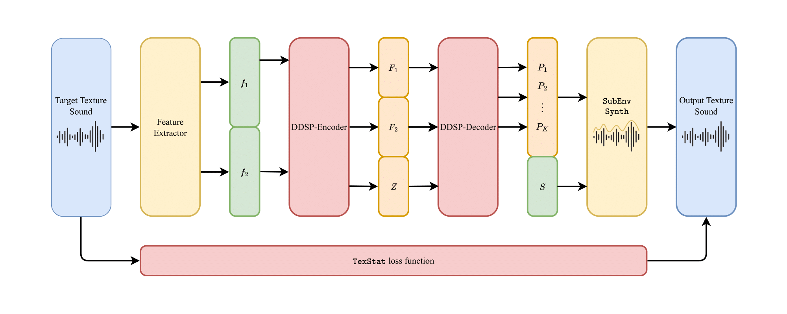
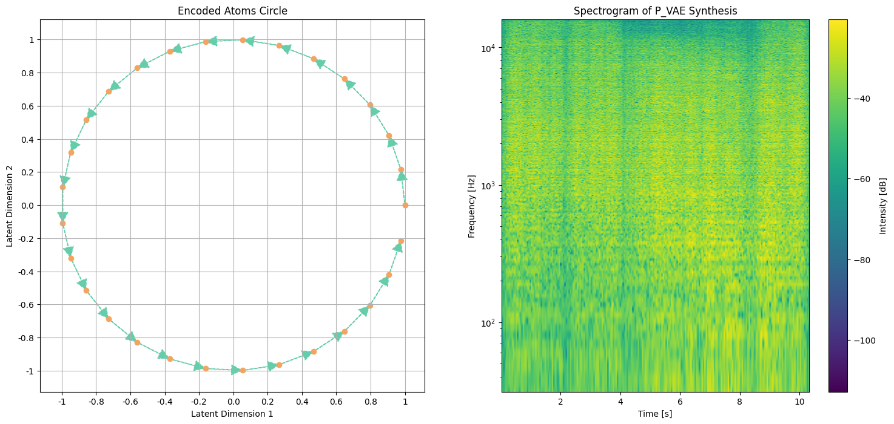

  
# ddsp_textures_thesis

[**Esteban Gutiérrez**](https://github.com/cordutie)1 and [**Lonce Wyse**](https://lonce.org/)1

1 *Department of Information and Communications Technologies, Universitat Pompeu Fabra*  

## Introduction

In this repository all the experiments conducted on the thesis "Statistics-Driven Texture Sound Synthesis Using Differentiable Digital Signal Processing-Based Architectures" authored by Esteban Gutiérrez and advised by Lonce Wyse can be found.

Figure 1. DDSP architecture modified to synthesize texture sounds.
 

This thesis explores adapting Differentiable Digital Signal Processing (DDSP) architectures for synthesizing and controlling texture sounds, which are complex and noisy compared to traditional pitched instrument timbres. The research introduces two innovative synthesizers: the $\texttt{SubEnv\ Synth}$, which applies amplitude envelopes to subband decompositions of white noise, and the $\texttt{P-VAE\ Synth}$, which integrates a Poisson process with a Variational Autoencoder (VAE) to manage time and event-based aspects of texture sounds. Additionally, it presents the $\texttt{TextStat}$ loss function, designed to evaluate texture sounds based on their statistical properties rather than short-term perceptual similarity. The thesis demonstrates the application of these synthesizers and the loss function within DDSP-based frameworks, highlighting mixed success in resynthesizing texture sounds and identifying challenges, particularly with the $\texttt{P-VAE\ Synth}$. Future work will focus on optimizing the $\texttt{TextStat}$ loss function, reassessing the VAE component, and exploring real-time implementations. This research lays the groundwork for advancing texture sound synthesis and provides valuable insights for both theoretical and practical developments in audio signal processing.

Figure 2. Latent space exploration.
 

## Experiments

The `experiments` folder contains several Jupyter notebooks detailing the experiments conducted for this thesis. Below is a description of each subfolder:

### 1. Signal Processors

This section introduces two differentiable signal processors explored in this thesis. Details and experiments related to these processors can be found in the corresponding Jupyter notebooks.

### 2. Loss Functions

In this section, a new loss function is introduced and preliminary research is conducted to assess its effectiveness. The relevant notebooks provide insights into the performance and efficiency of this loss function.

### 3. DDSP

This subfolder contains Jupyter notebooks on models based on Differentiable Digital Signal Processing (DDSP) using the previously defined signal processors and loss function. These notebooks cover the training, exploration, and evaluation of these DDSP-based models.

### 4. New Models

Here, you’ll find notebooks detailing the training and evaluation of new model variants derived from the ones introduced in the thesis. These models are examined for their performance and effectiveness in the experiments.

<!-- ## References
<a id="1">[1]</a> J. B. Dewey, “Cubic and quadratic distortion products in vibrations of the mouse cochlear apex,” JASA Express Letters 2, vol. 11, no. 114402, 2022.\
<a id="2">[2]</a> E. Zwicker, “Different behaviour of quadratic and cubic difference tones,” Hearing Research, vol. 1, no. 4, pp. 283–292, 1979.\
<a id="3">[3]</a> R. Plomp, “Detectability threshold for combination tones,” The Journal of the Acoustical Society of America, vol. 37, no. 1110, 1965.\
<a id="4">[4]</a> G. Kendall, C. Haworth, and R. F. Cádiz, “Sound synthesis with auditory distortion products,” Computer Music Journal, vol. 38, no. 4, 2014.\
<a id="5">[5]</a> C. Haworth, E. Gutiérrez and R. F. Cádiz, “Generating Quadratic Difference Tone Spectra for Auditory Distortion Synthesis,” (to be published). -->